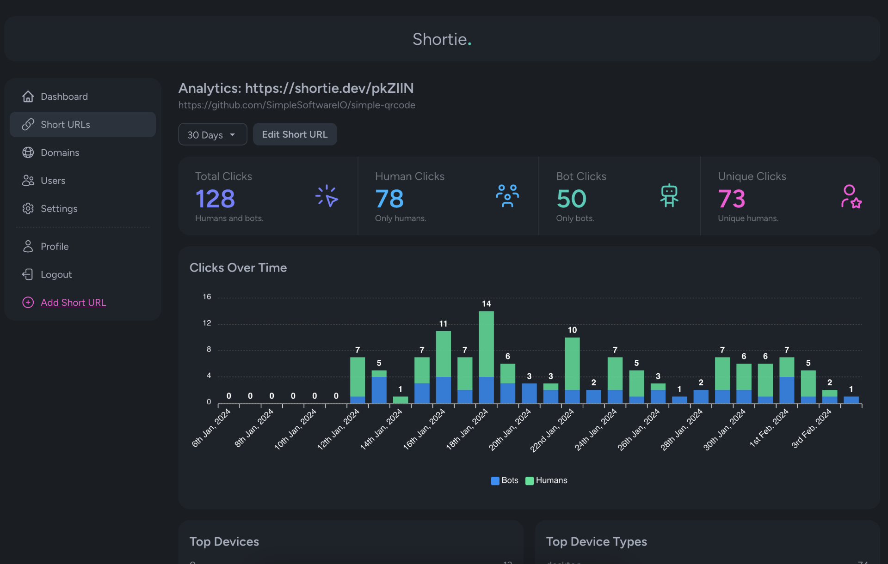
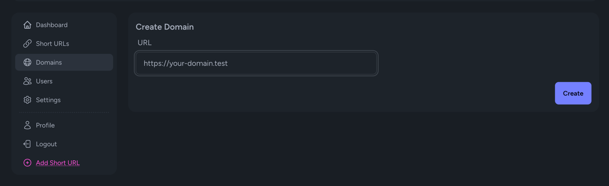

# Shortie.


Shortie is a project I created for managing short URLs and tracking.
Created with Laravel, Vue, and Inertia.

## Features
* Manage your Short URLs, either company-wide or per user.
* Short URL Analytics
* User management with configuration around allowing new users / default roles.
* Domain management for self-managed domains.

## Requirements
* PHP 8.2 / PHP 8.3
* MySQL / Postgre / SQLite
* Node v16: For rebuilding assets (optional)

## Installation
First download the project to where you intend to host it from.

via HTTPS:
```bash
$ git clone https://github.com/Harrk/Shortie.git
```

or via SSH:
```
$ git clone git@github.com:Harrk/Shortie.git
```

Install dependencies.
```bash
$ composer install --no-dev
```

Configure your `.env` file with your database credentials.
```bash
$ php artisan migrate
```

**Optional:** Assets are prebuilt, but you can rebuild them with the following:
```bash
$ yarn && yarn build
```

Create yourself an admin user.
```bash
$ php artisan app:create-admin
```

Navigate to the location you're hosting the project from to verify it's all set up.

## Setting Up
Before creating a short URL, you must set up a domain. You will need to do
this even if you only intend to use a single domain.



## Enabling Geolocation
Shortie uses the [laravel-geoip](https://github.com/Torann/laravel-geoip) package to assist with fetching the visitor's 
country and city from their IP address. By default, it uses the MaxMind database which also requires an account.

Note: Using the file/database caching driver is **not compatible** with laravel-geoip. 
Consider using a different driver, like Redis.

Once you have a MaxMind account, add your MaxMind API key to your `.env` file:
```
MAXMIND_LICENSE_KEY=YOUR_KEY
```

Then run the `geoip:update` command to fetch the latest database.
```bash
$ php artisan geoip:update
```

If using the MaxMind database you will need to keep this updated. This does not come preconfigured at this time, 
so you will want to run `php artisan geoip:update` via the cron/scheduler once a day.

Then finally you will need to enable the geolocation feature via the settings page in your Shortie admin area. 

There's a lot more to this so check the [documentation](https://lyften.com/projects/laravel-geoip/doc/)
for laravel-geoip for more information on this topic.

## Contributing
Please review the CONTRIBUTING.md document before making any contributions to the project.
